Real case study - one day hydraulic simulation
========================================
This example is a one day simulation of a real network. It aims to present the use of QGIS-EPANET plugin for model building, simulations run and results analysing. 

The EPANET model used in this example was developed by AC, Águas de Coimbra, E.M., a water utility company that manages the water supply and the drainage system of Coimbra, Portugal.
 

##1. Model characterization:

- Reservoirs: 1 un. 
- Tanks: 1 un. 
- Junctions: 272 un. 
- Pipes: 294 un. (29.27 km) 
- Pumps: 1 un. 
- Valves: 1 un. (pressure reducing valve - PRV) 

 

Overall map: 

 

##2. Model building: 

To build the EPANET model in QGIS you only have to organize GIS according with inp file format. The essential condition is to organize the attributes following the same order as the inp file format for each object - please check EPANET manual. 

For this example, we build the model already for you. You can open it in 2 ways: 

###2.1. Open the project with the spalite data base: 

 

###2.2. Insert the the shape files and the csv tables in your project: 

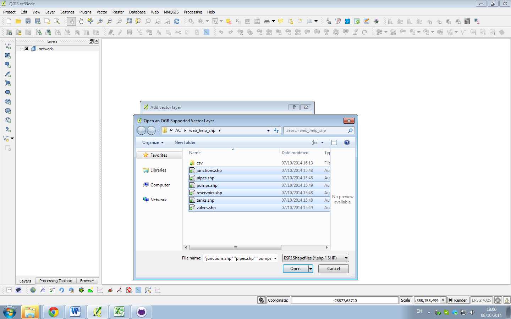
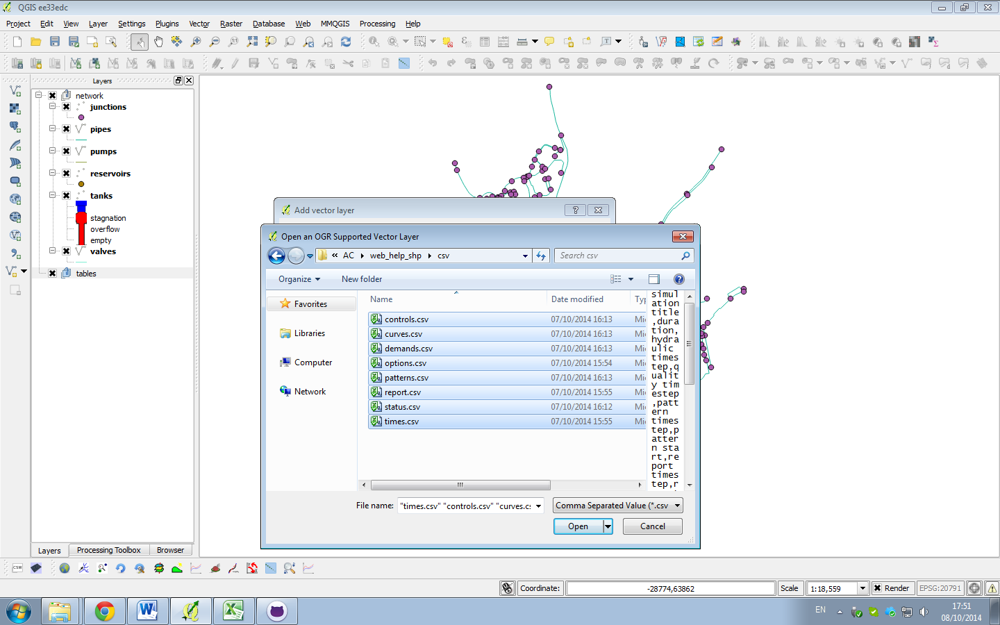
 

Finally, you should get the model in QGIS:  

 

You can add a base map in QGIS, such an OSM base layer with OpenLayers plugin: 

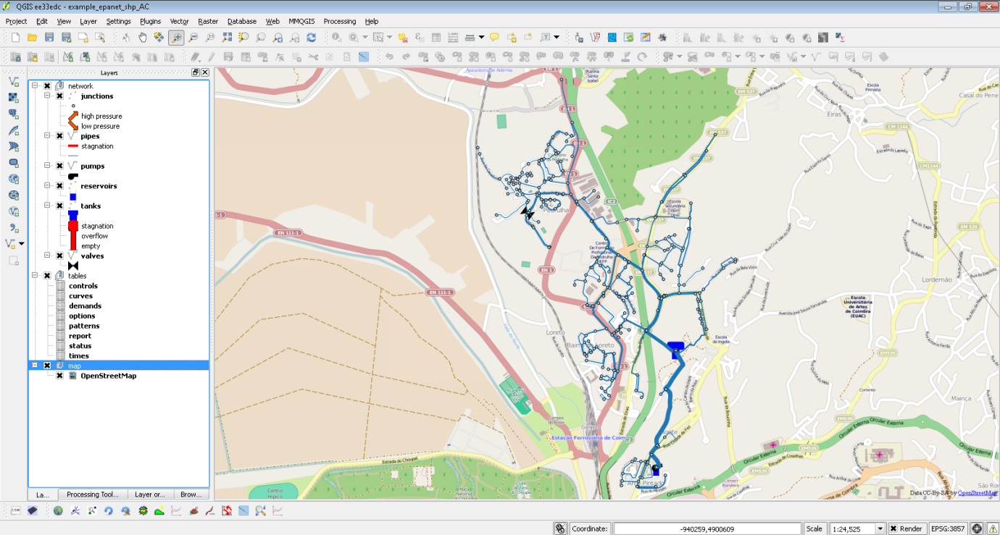
 

Note: This example is defined in the Portuguese Grid projection - EPSG:20791  

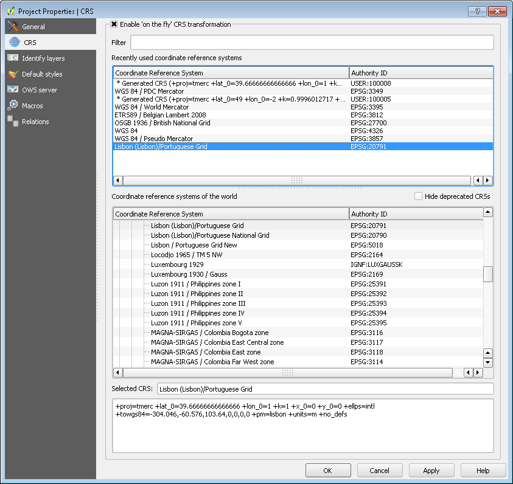
 

##3. Model dataset 

Now let's take a look at the model objects. You can open the attributes table for each one and check the parameters defined as follows. 

###3.1. Reservoir and pump details: 

In this example the reservoir is defined with a fixed head and the pump is defined with an head-discharge curve defined in the "curves" table. 

 

###3.2. Tank details: 

 

###3.3. PRV valve details: 

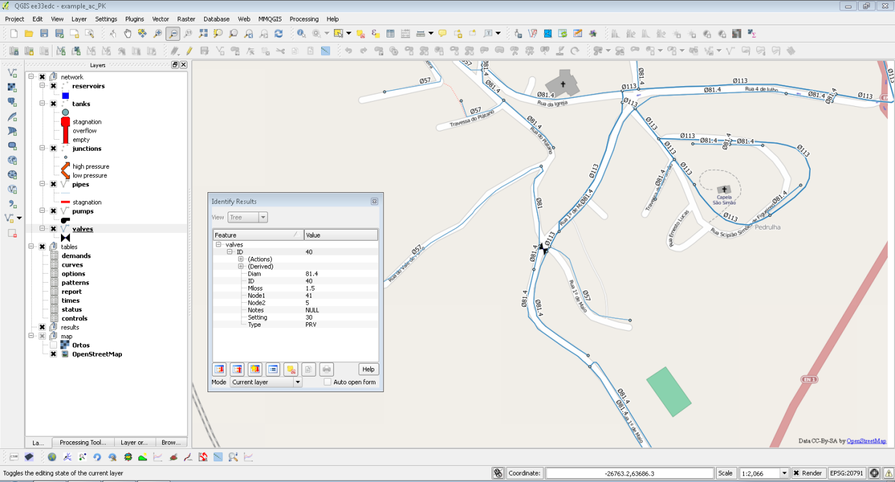
 

###3.4. Junctions details: 

Junctions are characterised essentially by the elevation and demands. The demands were calculated with the average consumptions of the geo-located clients and assigned to the nearest node. Each demand is defined by the demand value and its pattern. 

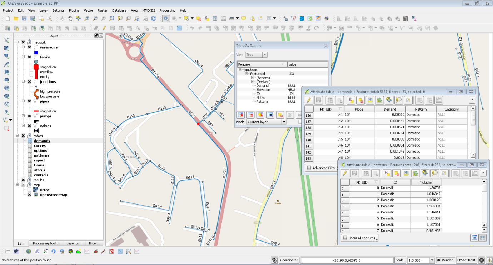
 

###3.5. Pipes details: 

 

###3.6. General tables: 

General tables presented in the next figure define the EPANET options, simulation times and report options. Related with the system operation, a status table define the initial condition of several objects and the controls define the operation rules of the pump. 

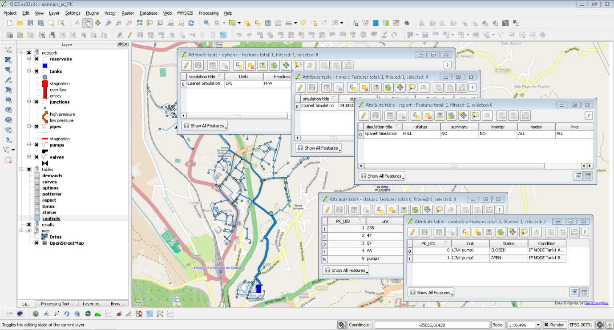
 

##4. Model runs 

To run the model you just have to open the EPANET-QGIS plugin in the processing toolbox. Then verify if all the objects are correctly selected, that should be automatically assigned to each category if they have similar name.

 

Press Run and check out the results in QGIS! 

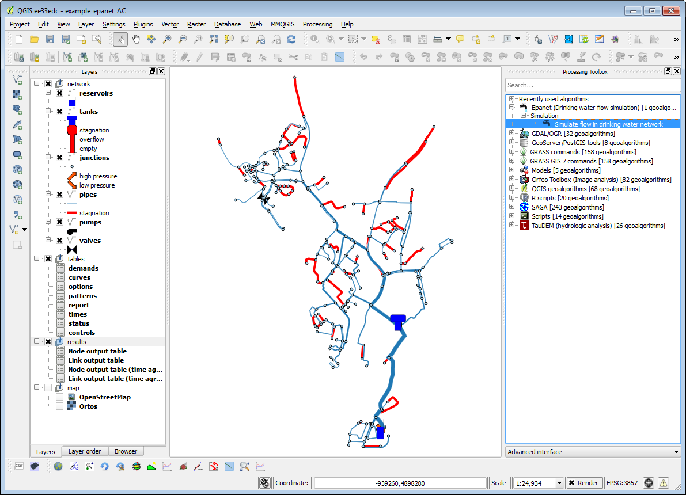
 

##5. Model results 

The results can also be visualized with support of a base map that can be OSM or existing ones: 

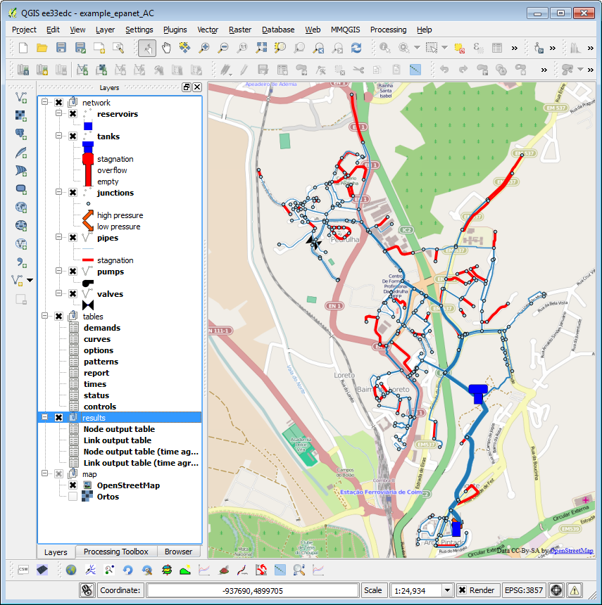
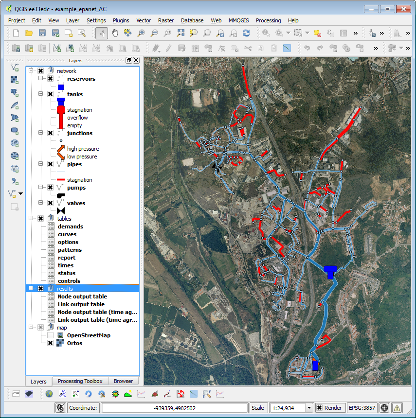
 

Then you can visualise results for each object. Just as an example, the following section show the simulation results for the main objects of this system. 

###5.1. Pump operation results: 

The following figure shows the flow in the pump and the pressure in its downstream node.  

 

###5.2. Tank results: 

The following figure shows the tank level and the flow velocity in its inlet and outlet pipes. 
 
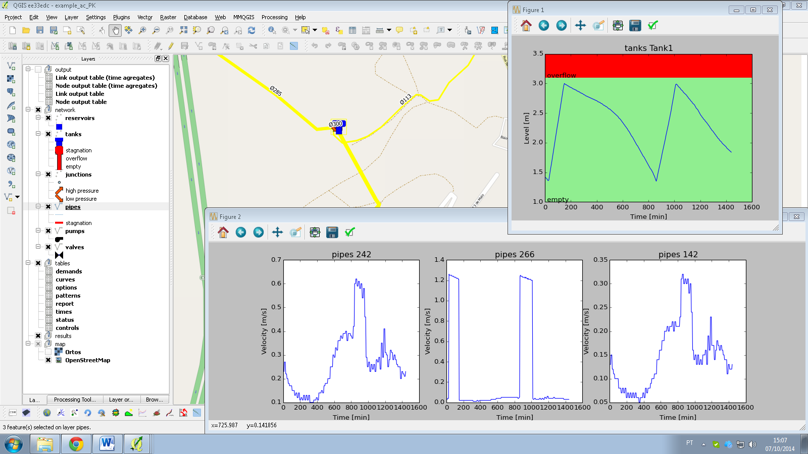
 

###5.2. PRV results: 

The following figure shows the PRV operation with the pressure in its inlet and outlet nodes. 

 

##6. Conclusions 

This example shows the EPANET-QGIS plugin running with a real network example. 
As an user, you can now take advantage of all the flexibility to manage data that QGIS allows and perform whatever scenario evaluation you want!
 

Credits
=======
 

Acknowledgements: AC, Águas de Coimbra, E.M. - http://www.aguasdecoimbra.pt; Luis Costa (Head of Planning and Construction Department), Sandra Pereira (Eng) 

Disclaimer: This example can only be used with the EPANET-QGIS plugin. It cannot be used for commercial proposes. The authors and the AC, Águas de Coimbra, E.M. disclaim any responsibility for its use.
